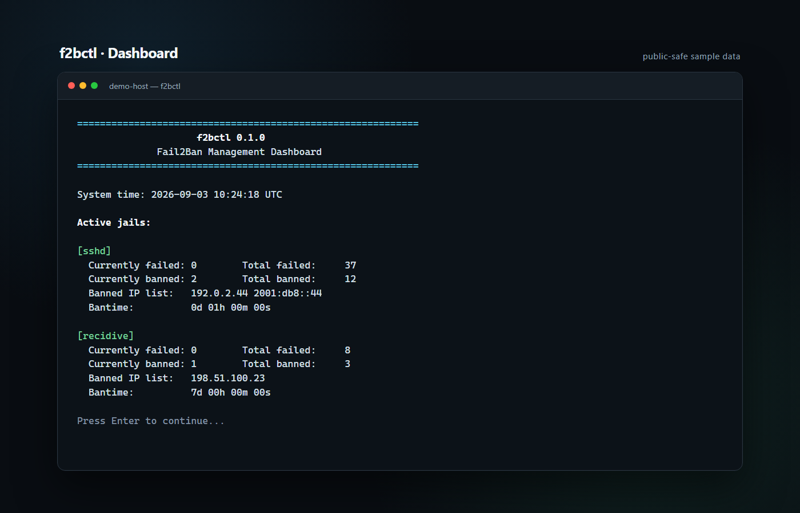
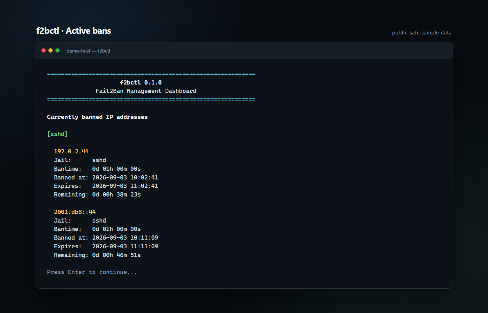
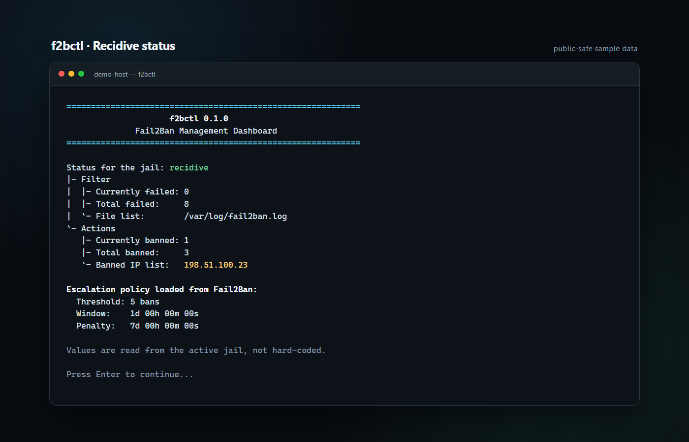
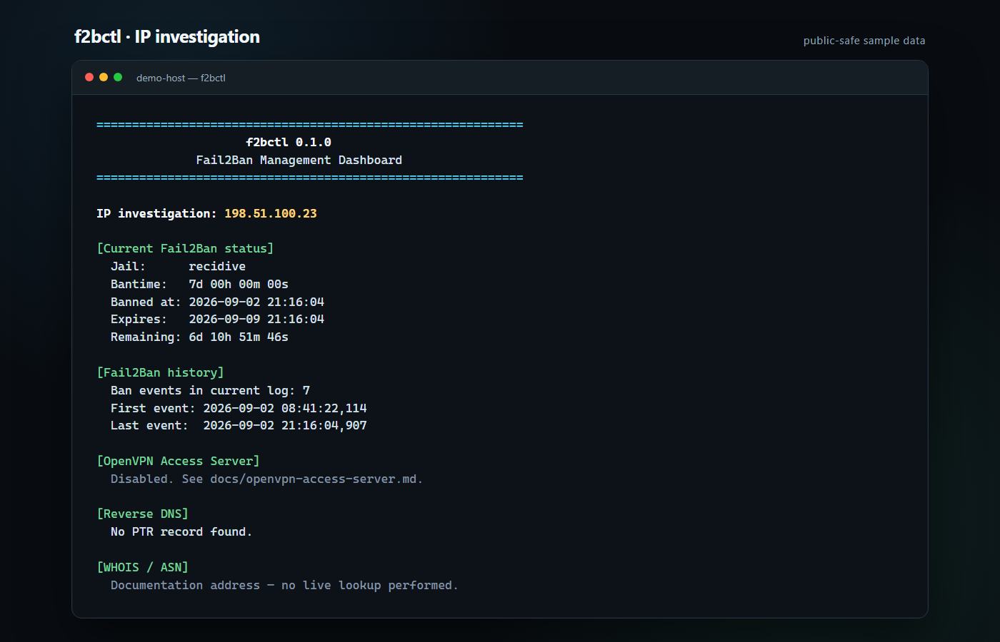

# f2bctl

`f2bctl` is an interactive command-line dashboard for Fail2Ban. It brings jail status, active bans, remaining time, repeat-offender analysis, IP investigation, manual ban controls, configuration checks, and incident-report export into one menu.

OpenVPN Access Server support is optional and disabled by default. The project does not install packages or modify Fail2Ban configuration automatically.

## Features

- Dashboard for all active jails
- Active bans with estimated expiry and remaining time
- Recent ban and unban events
- Top repeat offenders and recidive candidates
- IPv4 and IPv6 validation
- Reverse DNS and WHOIS enrichment when optional tools are available
- Manual ban and unban actions with confirmation
- Trusted-address display and Fail2Ban configuration checks
- Text incident reports with a reminder to review before sharing
- Optional, configurable OpenVPN Access Server log inspection

## Screenshots

All screenshots use reserved documentation addresses and simulated data.

| Dashboard | Active bans |
| --- | --- |
|  |  |

| Recidive status | IP investigation |
| --- | --- |
|  |  |

## Requirements

- Linux with Bash 4 or newer
- A configured, running Fail2Ban installation
- `fail2ban-client`, Python 3, and standard Unix text utilities
- `dig` or `nslookup`, and `whois`, only for optional enrichment

Run a dependency check without opening the dashboard:

```bash
./f2b --check
```

## Installation

Review the script before installing it, then:

```bash
sudo install -m 0755 f2b /usr/local/bin/f2b
sudo f2b
```

The script normally re-runs itself through `sudo` because the Fail2Ban control socket and logs are commonly restricted to root.

## Configuration

Defaults can be overridden in `/etc/f2bctl.conf` or with environment variables:

```bash
F2B_CLIENT="fail2ban-client"
F2B_LOG="/var/log/fail2ban.log"
ENABLE_OPENVPN_AS=0
OVPN_LOG="/var/log/openvpnas.log"
```

OpenVPN Access Server inspection remains off until `ENABLE_OPENVPN_AS=1` is set. See [OpenVPN Access Server integration](docs/openvpn-access-server.md).

## Recidive

`f2bctl` reads the active recidive jail's `maxretry`, `findtime`, and `bantime` values directly from Fail2Ban. It does not impose its own escalation policy. A conservative example is included in [`examples/recidive.local`](examples/recidive.local); review it against your requirements before use.

## Screenshots:


## Security notes

- `f2bctl` is an administrative interface and should only be run by trusted operators.
- Manual ban and unban actions change firewall state and require confirmation.
- Incident reports can contain IP addresses and log excerpts. Review them before sharing.
- Example configuration is disabled by default and contains no private network ranges, hostnames, credentials, or email addresses.
- No external API keys are required.

## License

MIT. See [LICENSE](LICENSE).
